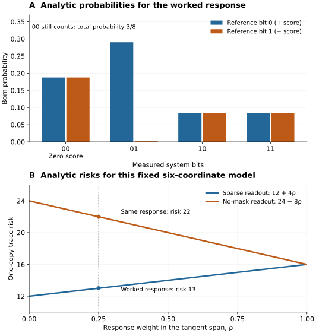

# From a quantum response to every gradient coordinate

[Home](../README.md) · [Theory](THEORY.md) · [Implementation](IMPLEMENTATION.md) · [Reproduction](../REPRODUCIBILITY.md)

Allow about 20–30 minutes, including the calculations and executable example.
You need states, gates, the Born rule, and ordinary vector algebra. The aim is
to understand what is measured, why its average is the entire gradient, and what
the exact optimality statement does—and does not—say.

## 1. The experiment and the question

A quantum circuit prepares a state that depends on several adjustable angles.
To change those angles intelligently, we want a classical number for **each**
derivative of an objective. A single measurement produces random bits, not an
exact derivative vector. The question here is how much total statistical error
is unavoidable when all coordinates must come from one shared measurement.

The experiment supplies one reference qubit and an `n`-qubit system in the state

```math
|\Omega(q)\rangle=
\frac{|0\rangle|0^n\rangle+|1\rangle|q\rangle}{\sqrt2}.
```

The first branch is a known reference. The second contains an unknown **real,
normalized** response vector `q` of dimension `N = 2^n`. “Unknown” means the
decoder does not receive its amplitudes as classical input. The relative phase
between the branches is supplied and meaningful: replacing `q` by `−q` changes
this joint state, even though those two system states alone differ only by a
global phase.

Known real vectors `t₁,…,tₚ` tell us which response amplitudes matter for the
derivatives. Put them in the columns of an `N × P` matrix `T`. The task is

```math
g(q)=2T^{\mathsf T}q,\qquad T^{\mathsf T}|0^n\rangle=0.
```

The output has **all `P` original parameter coordinates**. The columns may
overlap or repeat; `P` need not be the number of independent directions.
The zero-reference condition says every column is orthogonal to `|0ⁿ⟩`.

For intuition, let a real circuit `U(θ)` prepare `ψ(θ)=U(θ)|0ⁿ⟩`, and consider
an objective `C(θ)=⟨ψ(θ)|O|ψ(θ)⟩` with a real Hermitian unitary `O`. At the
chosen parameter point, set

```math
t_j=U^{\mathsf T}\partial_j\psi,
\qquad q=U^{\mathsf T}O\psi.
```

Differentiating the objective gives `∂ⱼC=2tⱼᵀq`. Normalization of the real state
gives `tⱼᵀ|0ⁿ⟩=0`; unitarity of `O` gives `‖q‖=1`. Controlled response
preparation and ordinary circuit reversal provide the stated interface when
available. Their costs belong to the experiment. The measurement theorem starts
from the supplied copy; it does not make that preparation free.

## 2. A complete two-qubit example

Take one existing two-qubit circuit block with six rotations, in this order:

| Parameter | Pauli generator | Tangent at zero angles |
|---|---|---|
| `θ₁` | `YI` | `\|10⟩` |
| `θ₂` | `IY` | `\|01⟩` |
| `θ₃` | `YX` | `\|11⟩` |
| `θ₄` | `XY` | `\|11⟩` |
| `θ₅` | `YZ` | `\|10⟩` |
| `θ₆` | `ZY` | `\|01⟩` |

`AB` means `A ⊗ B`, with the left bit first. Each rotation is
`R_A(θ)=exp(−iθA)`: these are **full angles**. A library's conventional
`RY(φ)=exp(−iφY/2)` therefore needs `φ=2θ`. Derivatives with respect to `φ`
are half the derivatives with respect to `θ`; that normalization matters.

For example, `−i(Y ⊗ I)|00⟩=|10⟩`. At zero angles all preceding and following
gates are identities, giving the table directly. In computational order
`00,01,10,11`, the whole tangent matrix is

```math
T=\begin{pmatrix}
0&0&0&0&0&0\\
0&1&0&0&0&1\\
1&0&0&0&1&0\\
0&0&1&1&0&0
\end{pmatrix}.
```

Use the concrete response

```math
|q\rangle=\frac{\sqrt3}{2}|00\rangle+\frac12|01\rangle.
```

One physical objective that gives this response at zero angles is
`O = I ⊗ [(√3/2)Z + (1/2)X]`. This is real, Hermitian, and unitary. We know
`q` here to check the teaching calculation; the measurement and decoder below
work without being told it. Direct matrix multiplication gives

```math
g=(0,1,0,0,0,1)^{\mathsf T}.
```

There are six derivatives but only three independent tangent directions.
Indeed `rank(T)=3`, and the three nonzero eigenvalues of `TᵀT` are all `2`.
The repeated tangents remain distinct parameter coordinates in the output.

## 3. Make the reference interfere with the response

The three active system addresses are `01`, `10`, and `11`. Replace the known
reference `|00⟩` by

```math
|c\rangle=\frac{|01\rangle+|10\rangle+|11\rangle}{\sqrt3},
```

**only when the reference qubit is zero**. Leave the entire reference-one
branch unchanged. The joint state is now
`(|0⟩|c⟩+|1⟩|q⟩)/√2`. Apply a Hadamard to the reference qubit:

```math
\frac12\left[|0\rangle(|c\rangle+|q\rangle)
+|1\rangle(|c\rangle-|q\rangle)\right].
```

Measure all three physical qubits. Write the reference bit as `b` and the two
system bits as `x`. The probability is

```math
p(b,x)=\frac14\bigl(c_x+(-1)^bq_x\bigr)^2.
```

Why add the reference? Measuring `q` alone reveals squared amplitudes and loses
their signs. Interference produces a signed difference:

```math
p(0,x)-p(1,x)=c_xq_x.
```

The same known circuit works for every real `q`. An outcome with `b=0` adds a
positive score; `b=1` adds a negative one. These signs recover the linear
amplitudes required by `Tᵀq`.

## 4. Turn the bits into a six-entry record

Let `kₓ` be row `x` of `T`, viewed as a column vector with six entries. Define
three convenient vectors in the **original** parameter order:

```math
v_{01}=(0,1,0,0,0,1)^{\mathsf T},\qquad
v_{10}=(1,0,0,0,1,0)^{\mathsf T},
```

```math
v_{11}=(0,0,1,1,0,0)^{\mathsf T}.
```

For an active `x`, return the record

```math
Z(b,x)=2(-1)^b\frac{k_x}{c_x}
=2\sqrt3\,(-1)^b v_x.
```

For `x=00`, return the zero six-vector. All probabilities and records for our
chosen response are now explicit:

| Measured `b x` | Probability | Returned record |
|---|---|---|
| `0 00` | `3/16` | `0` |
| `1 00` | `3/16` | `0` |
| `0 01` | `7/48 + 1/(4√3)` | `+2√3 v₀₁` |
| `1 01` | `7/48 − 1/(4√3)` | `−2√3 v₀₁` |
| `0 10` | `1/12` | `+2√3 v₁₀` |
| `1 10` | `1/12` | `−2√3 v₁₀` |
| `0 11` | `1/12` | `+2√3 v₁₁` |
| `1 11` | `1/12` | `−2√3 v₁₁` |

The probabilities sum to one. The `10` and `11` signs cancel in expectation.
For `01`, their probability difference is `1/(2√3)`, so its contribution is
`[1/(2√3)]·2√3 v₀₁=v₀₁`. Therefore `E[Z]=g` exactly.

The same argument for an arbitrary real response is short:

```math
\mathbb E_q Z
=\sum_{x:c_x>0}\frac{2k_x}{c_x}
\bigl[p(0,x)-p(1,x)\bigr]
=2\sum_x k_xq_x=2T^{\mathsf T}q.
```

This property is **unbiasedness**. It describes the average over repetitions;
an individual returned vector is normally far from the true gradient.

### Zero records are real trials

Here the inactive outcome `00` occurs with total probability `3/8`. It supplies
no update but still counts as one experiment. With `K` independent copies,
return the ordinary sample mean

```math
\widehat g=\frac1K\sum_{k=1}^K Z_k.
```

Dividing by only the number of active outcomes estimates a different quantity.
In this example their total probability is `5/8`, so the conditional active
mean is `(8/5)g`, not `g`. A zero update is not permission to discard a trial.

You need not allocate six entries for every shot. Maintain three signed counts
`D₀₁,D₁₀,D₁₁`, adding `+1` or `−1` to the observed active address. Then output

```math
\widehat g=\frac{2\sqrt3}{K}
(D_{10},D_{01},D_{11},D_{11},D_{10},D_{01})^{\mathsf T}.
```

This explains how three channels produce **all six** original derivatives.
For larger blocks, a stored local matrix performs the same final conversion.
Reading the physical bits and writing every output coordinate still cost work.

## 5. Quantify the error before discussing optimality

For an unbiased vector record, the **trace risk** is

```math
\mathcal R(q)=\mathbb E_q\|Z-g(q)\|_2^2
=\mathrm{tr}\,\mathrm{Cov}_q(Z).
```

It sums the variances of the original coordinates. It is neither a failure
probability nor a gate count. Our active records have squared length `24`
because they have two nonzero entries of magnitude `2√3`. They occur with
probability `5/8`; meanwhile `‖g‖²=2`. Hence

```math
\mathcal R(q)=24\cdot\frac58-2=13.
```

For any real unit response in this example, let `ρ` denote its squared weight
on `span{|01⟩,|10⟩,|11⟩}`. The sparse readout has risk `12+4ρ`. Its worst case
over `0 ≤ ρ ≤ 1` is therefore `16`. The no-mask benchmark has risk `24−8ρ`,
whose worst case is `24`. For the worked response `ρ=1/4`, those risks are `13`
and `22`, respectively. The two worst cases need not be the same response.



*Both panels are analytic formulas, not sampled results. Panel A uses the
specified response; panel B varies its weight in the same fixed tangent space.
The [compact values and source hashes](../figures/tutorial-readout.json) and
[regeneration script](../figures/generate_tutorial.py) are retained.*

Averaging `K` independent records reduces the mean squared whole-vector error
to `R(q)/K`. For example, `K=1600` guarantees mean squared error at most `0.01`
for this measurement across all allowed responses. That is a root mean squared
error bound of `0.1`, not a 99% confidence statement. Markov's inequality gives
the sufficient guarantee

```math
K\ge\frac{16}{\delta\varepsilon^2}
\quad\Longrightarrow\quad
\Pr[\|\widehat g-g\|_2>\varepsilon]\le\delta.
```

Here `ε>0` is the permitted Euclidean error and `0<δ<1` the failure probability.
This conversion is deliberately stated as sufficient. The one-copy theorem
does not prove that this many copies are necessary for high confidence.

## 6. The exact theorem and its assumptions

Return to any known real `N × P` matrix `T` with `Tᵀ|0ⁿ⟩=0`. Suppose its rank
is `r≥1`, and **every nonzero eigenvalue of `TᵀT` equals the same `λ>0`**.
Equivalently, its nonzero singular values are all `√λ`.

Consider one fixed overall measurement and vector decoder. They can depend on
`T`, but not on the unknown `q`. Require finite second moments and
`E_q Z=2Tᵀq` for **every real unit `q`**. The theorem minimizes the worst-case
trace risk over *all* such measurements:

```math
\inf_{\text{admissible measurements and decoders}}
\ \sup_{\substack{q\in\mathbb R^N\\\|q\|_2=1}}
\mathcal R(q)
=\lambda\max\{2r,4(r-1)\}.
```

A measurement here may be any positive-operator-valued measure, or **POVM**:
positive effects `Eω` that sum to the identity, with outcome probability
`⟨Ω(q)|Eω|Ω(q)⟩`. Ancillas and randomized settings are included. If a protocol
randomizes a setting, put that setting in the overall outcome label. Only the
complete procedure must be unbiased; the theorem does **not** require each
setting to be unbiased separately.

“Minimax” means choosing one procedure whose largest risk over the allowed
responses is as small as possible. “Universally unbiased” means correct mean
at every such response, not just near a convenient point. Neither permits
choosing a different decoder after being told the unknown response.

Two different obstructions produce the maximum in the formula:

1. At `q=|0ⁿ⟩`, the target is zero, but universal unbiasedness still forces
   second moments of at least `2rλ`. The proof uses the first-moment constraints
   and positivity of measurement second moments.
2. Averaging over the positive and negative tangent basis directions gives a
   second lower bound, `4(r−1)λ`, by completeness and Cauchy–Schwarz.

For rank one the first bound dominates; at rank two they coincide; for rank
three and above the second dominates. Our example has `r=3` and `λ=2`, giving
`2·max{6,8}=16`. It attains the worst-case limit even though its risk at our
chosen response is only `13`. The [complete proof](THEORY.md) establishes both
lower bounds with the same quantifiers.

## 7. The attaining measurement in any equal-spectrum model

Factor `T=√λ L Vᵀ`, where the `r` columns `uᵢ` of `L` are orthonormal tangent
directions in the system space, and the `r` columns of `V` are orthonormal
vectors in the original `P`-coordinate output space. Thus `L` has size `N × r`
and `V` has size `P × r`. Define

```math
|a\rangle=|0,0^n\rangle,\qquad
|b_i\rangle=|1\rangle|u_i\rangle.
```

For each direction `i` and sign `σ∈{+1,−1}`, use the effect

```math
E_{i,\sigma}=\frac1{2r}
(|a\rangle+\sigma\sqrt r|b_i\rangle)
(\langle a|+\sigma\sqrt r\langle b_i|).
```

Their sum is the projector onto `span{a,b₁,…,bᵣ}`. One complementary positive
effect completes the identity and returns zero. This is at most `2r+1` effects;
no assertion that this outcome count is minimal is needed.

Return `Zᵢ,σ=2σ√(rλ)Veᵢ`, where `eᵢ` selects the `i`th coordinate in `r`
dimensions. For `z=Lᵀq`, the probabilities are

```math
p(i,\sigma\mid q)=\frac{(1+\sigma\sqrt r\,z_i)^2}{4r},
\qquad p(*\mid q)=\frac{1-\|z\|_2^2}{2}.
```

These are exactly the interference probabilities above in a tangent basis.
The signed mean is `2√λ Vz=2Tᵀq`. Active probability is `(1+‖z‖²)/2`, and every
active score has squared length `4rλ`. Subtracting the squared mean yields

```math
\mathcal R(q)=2r\lambda+(2r-4)\lambda\|L^{\mathsf T}q\|_2^2.
```

Maximizing this expression proves attainability. The multiplication by `V`
restores every original parameter derivative, including redundant coordinates.
Changing to singular coordinates for a proof does not redefine the requested
error norm or output.

This construction is a measurement specification. For an arbitrary dense `L`,
constructing its basis transformation can be expensive. Counting effects alone
does not give an efficient circuit. In the worked local family the tangent
basis is already computational, so the controlled reference preparation gives
an explicit implementation.

## 8. Run the same example

From a clean checkout, install the package and run:

```bash
python -m pip install -e .
python examples/flat_readout.py
```

The example checks the analytic Born probabilities against execution of the
compiled elementary gates. It reports the exact mean
`[0, 1, 0, 0, 0, 1]`, trace risk `13`, and worst-case risk `16`.
It also decodes a fixed illustrative record set of sixteen trials, with six
inactive records. That finite-record estimate need not equal the exact mean.

The maintained entry point is:

```python
import numpy as np
from qbp_frames import disjoint

plan = disjoint.compile_plan(np.zeros((1, 6)))
print(plan.counts())
print(plan.exact_risk_bound())
```

This plan has nine CNOTs, eight full-angle `Ry` rotations, two `X` gates, and
one final `H`, plus three terminal measurements. These counts exclude the
common supplied-state preparation. They are the counts of the actual emitted
circuit, not minimum possible counts.

For `m` disjoint blocks the construction uses `n=2m` system qubits, `P=6m`
coordinates, and a linear number of logical gates. At zero angles its exact
worst-case risk is `4P−8`, compared with the no-mask benchmark `4P`. The absolute
gap is eight; its ratio tends to one as the number of parameters grows. It
does not establish an asymptotic runtime advantage.

The [implementation guide](IMPLEMENTATION.md) specifies shapes, coordinate
ordering, bit order, input checks, and numerical limits. The small example uses
a dense statevector solely for verification. The larger demonstration in
[reproduction](../REPRODUCIBILITY.md) compiles structured inputs without
materializing a global response vector.

## 9. What extends, and what remains outside the claim

For more general known tangents, let `kₓ` again be row `x` of `T` and let
`s=‖T‖²_F=tr(TᵀT)`. Preparing the **row-norm reference**
`cₓ=‖kₓ‖/√s`, then using the same signed score `2(−1)ᵇkₓ/cₓ` on nonzero rows,
remains unbiased and has trace risk at most `4s`.

The existing overlapping-interval compiler prepares that reference with
`O(n·2ʷ)` logical gates when each tangent is supported on an interval of width
at most `w`. It charges construction of local tangent tables, storage or
regeneration of the gate program, reading physical bits, and the complete
output. Overlap contributions enter a row norm by **adding squared amplitudes**;
adding the tangent vectors coherently would prepare a different reference.

For general overlaps, the set of nonzero computational rows can be larger than
the tangent span. Consequently this compiler is not a generic exact minimax
measurement. Its width-dependent cost is also real: a small tangent rank alone
does not make all preparation or decoding efficient.

Keep four further boundaries in mind:

- The exact theorem assumes a **real pure response**, a supplied phase reference,
  one copy per experiment, and overall universal unbiasedness. Complex or mixed
  responses, biased estimators, collective measurements on several copies, and
  additional coherent access are different problems.
- Exact logical gates and unbiased formulas do not remove finite-precision
  errors. Gate synthesis, classical table errors, state preparation, and noise
  need their own budgets; the software's numerical checks are not interval
  certificates.
- The phase/Walsh measurement family has a narrower measurement and decoder contract
  than arbitrary POVMs. A bound for that family is not an all-measurement bound.
- No strongest-method end-to-end advantage or final novelty clearance is
  established. The retained parity comparison found no accepted positive-round
  parity winners in its fixed model. Statistical optimality does not erase that
  negative evidence.

Use [comparisons and limitations](COMPARISONS.md) for the precise eligible
benchmarks, and the [evidence index](EVIDENCE.md) to trace claims to their proofs,
implementations, and checks.

## 10. Self-check

1. Why can measuring the response alone not generally recover a signed
   derivative, while the reference experiment can?
2. What gradient does the worked response produce? Why are there six entries
   despite only three tangent directions?
3. In sixteen trials, suppose the signed active counts are
   `D₀₁=7`, `D₁₀=0`, `D₁₁=1`, with six inactive trials. What is the estimate?
4. Why is the example's risk `13` compatible with an optimum of `16`?
5. Does a `2r+1`-effect measurement automatically have a linear-size circuit?
6. Does averaging until the mean squared error is small establish the exact
   optimal number of copies needed for 99% confidence?

### Answers

1. Squared amplitudes lose signs. Reference interference exposes the difference
   `p(0,x)−p(1,x)=cₓqₓ`, retaining the sign relative to the supplied reference.
2. `(0,1,0,0,0,1)`. Two distinct parameters share each tangent direction; the
   output still lists each original derivative separately.
3. `(0,7√3/8,√3/8,√3/8,0,7√3/8)`. The denominator is sixteen, including the six
   zero records. This is one finite-record estimate, not the exact gradient.
4. `13` is the risk at one response; `16` is the smallest achievable worst-case
   risk over all allowed responses for a fixed universally unbiased procedure.
5. No. Preparing or resolving an arbitrary known tangent basis and mapping back
   to all output coordinates can be expensive. Structure makes the explicit
   one-layer construction efficient.
6. No. Markov gives a sufficient conversion; neither that conversion nor the
   one-copy minimax theorem is an exact optimal confidence-sample theorem.

Continue with the [full theorem and proof](THEORY.md), or execute the
[reproduction routes](../REPRODUCIBILITY.md) and inspect the linked evidence.
